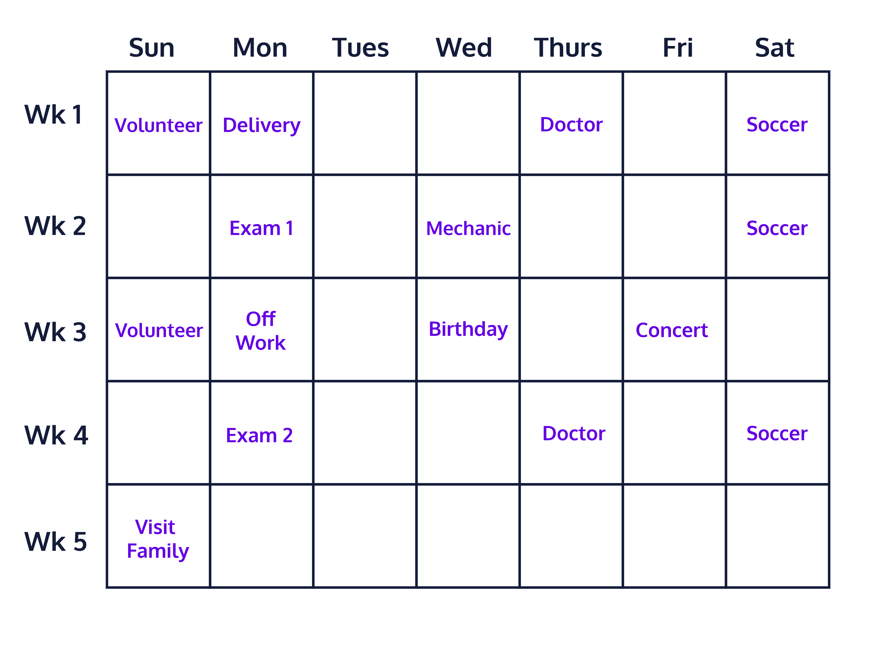

Combining Traversal and Conditional Logic
When working with 2D arrays, it is important to be able to combine traversal logic with conditional logic in order to effectively navigate and process the data. Here are a few ways in how conditional logic can affect 2D array traversal:

Skipping or selecting certain rows and columns
Modifying elements only if they meet certain conditions
Complex calculations using the 2D array data
Formatting the 2D array
Avoiding exceptions / smart processing
Let’s go over a few examples which use these ideas:

First, let’s think about a situation where you have some string data inside a 2D array. We have an application which allows users to input events on a calendar. This is represented by a 5x7 2D array of strings. Due to the fact that the number of days in each month is slightly different and that there are less than 35 days in a month, we know that some of our elements are going to be empty. We want our application to do a few things:

Detect which days of which weeks have something planned and alert us about the event.
Count the number of events for each week
Count the number of events for each day
Here is a visualization of what our calendar data looks like after a user has entered in some event information:

A calendar

Here’s what our calendar data looks like in our application

String[][] calendar = {{"volunteer", "delivery", null, null, "doctor", null, "soccer"}, {null, "exam 1", null, "mechanic", null, null, "soccer"}, {"volunteer", "off work", null, "birthday", null, "concert", null}, {null, "exam 2", null, null, "doctor", null, "soccer"}, {"visit family", null, null, null, null, null, null}};

Let’s look at some code which accomplishes the requirements above. Carefully look through each line of code and read all of the comments.

There are a few things to note:

Row-major or column-major order can be used to access the individual events
Row-major order must be used to count the number of events per week since each row represents a week
Let’s take care of the first 2 requirements in one set of nested row-major loops

for(int i = 0; i < calendar.length; i++) {
    numberOfEventsPerWeek = 0;
    for(int j = 0; j < calendar[i].length; j++) {
        // We need conditional logic to ensure that we do not count the empty days
        String event = calendar[i][j];
        if(event!=null && !event.equals("")) {
            // If the day does not have a null value and an empty string for an event, then we print it and count it
            System.out.println("Week: " + (i+1) + ", Day: " + (j+1) + ", Event: " + event);
            numberOfEventsPerWeek++;
        }
    }
    System.out.println("Total number of events for week "+ (i+1) +": " + numberOfEventsPerWeek + "\n");
}

The above code produces this output:

Week: 1, Day: 1, Event: volunteer
Week: 1, Day: 2, Event: delivery
Week: 1, Day: 5, Event: doctor
Week: 1, Day: 7, Event: soccer
Total number of events for week 1: 4

Week: 2, Day: 2, Event: exam 1
Week: 2, Day: 4, Event: mechanic
Week: 2, Day: 7, Event: soccer
Total number of events for week 2: 3

Week: 3, Day: 1, Event: volunteer
Week: 3, Day: 2, Event: off work
Week: 3, Day: 4, Event: birthday
Week: 3, Day: 6, Event: concert
Total number of events for week 3: 4

Week: 4, Day: 2, Event: exam 2
Week: 4, Day: 5, Event: doctor
Week: 4, Day: 7, Event: soccer
Total number of events for week 4: 3

Week: 5, Day: 1, Event: visit family
Total number of events for week 5: 1

Now let’s complete the third requirement. Since we need to count all of the events for each of the weekdays, we will need to traverse the calendar vertically.

int numberOfEventsPerWeekday = 0;
// We will use this array of day strings for our output later on so we don't have (day: 1)
String[] days = {"Sundays", "Mondays", "Tuesdays", "Wednesdays", "Thursdays", "Fridays", "Saturdays"};
for(int i = 0; i < calendar[0].length; i++) {
    numberOfEventsPerWeekday = 0;
    for(int j = 0; j < calendar.length; j++) {
        // Don't forget to flip the iterators in the accessor since we are flipping the direction we are navigating.
        // Remember, i now controls columns and j now controls rows
        String event = calendar[j][i];
        if(event!=null && !event.equals("")) {
            // Make sure we have an event for the day before counting it
            numberOfEventsPerWeekday++;
        }
    }
    // Use the days string array from earlier to convert the day index to a real weekday string
    System.out.println("Number of events on " + days[i] + ": " + numberOfEventsPerWeekday);
}

The output is:

Number of events on Sundays: 3
Number of events on Mondays: 4
Number of events on Tuesdays: 0
Number of events on Wednesdays: 2
Number of events on Thursdays: 2
Number of events on Fridays: 1
Number of events on Saturdays: 3

This example uses many of the concepts we have learned before. We use row-major order, column-major order, as well as including conditional logic to ensure that we have data for the elements we are accessing.

Additionally, we can use conditional logic to skip portions of the 2D array. For example, let’s say we wanted to print the events for weekdays only and skip the weekends.

We could use a conditional statement such as if(j!=0 && j!=6) in order to skip Sunday (0) and Saturday (6).

These modifications to our 2D array traversal are very common when processing data in applications. We need to know which cells to look at (skipping column titles for example), which cells to ignore (empty data, invalid data, outliers, etc.), and which cells to convert (converting string input from a file to numbers).

Let’s try an example!

We are making a simple grayscale image editor program and we want to apply some modifications to the image. We have a 4x8 pixel image that is stored as a 2D array of integers. The integer value represents the brightness of the pixel, where the acceptable values are between 0 and 255, inclusive.